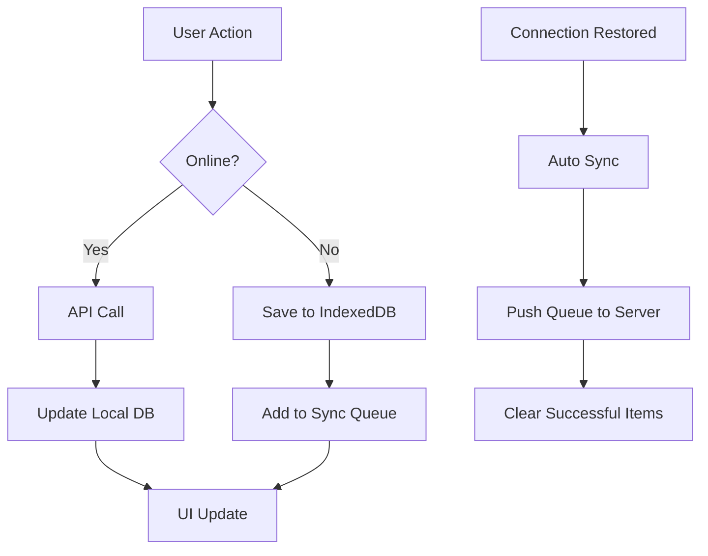

# Offline Support

## ✨ Overview

The Transactions App includes comprehensive offline support with automatic synchronization. Users can create, edit, and delete transactions even when offline, and the app will automatically sync changes to the server when an internet connection is restored.

## 🚀 Quick Start

### No Setup Required!

Just use the app normally. The offline support works automatically:

- **When Online:** Changes save directly to server + sync every 30 seconds
- **When Offline:** Changes save to your device (IndexedDB) + queue for sync
- **When Back Online:** Automatic sync starts immediately

### Visual Indicators

Look at the top of your screen for connection status:

- 📡 **Offline Mode** - No internet connection
- 🔄 **Syncing...** - Upload in progress
- ⏳ **X items pending** - Waiting to sync
- ✅ **Synced** - All changes saved to server

### Manual Sync

Click the "Sync Now" button in the offline indicator if you want to force an immediate sync.

## 🎛️ User Interface & Experience

### Sync Location

The main sync interface is available in two locations:

1. **Top Indicator** - Always visible offline indicator at the top of the screen
2. **Profile Page** - Navigate to **Profile** → **Offline Sync** section for detailed status

### Profile Page Sync Interface

```
┌─────────────────────────────────────┐
│ 🌐 Offline Sync                     │
├─────────────────────────────────────┤
│ Connection Status  │ Pending Items  │
│ 🟢 Online         │ 0 items        │
├─────────────────────────────────────┤
│ Last synced: Nov 3, 2025, 2:30 PM  │
│                                     │
│ The app automatically syncs your    │
│ data every 30 seconds when online.  │
│                                     │
│ [🔄 Sync Now]                      │
└─────────────────────────────────────┘
```

### Sync States

#### 🟢 Online & Synced

- **Status:** Auto-sync running every 30 seconds
- **Pending:** 0 items
- **Actions:** Manual sync available for immediate update
- **Indicator:** Shows last sync timestamp

#### 🟡 Online with Pending Items

- **Status:** Auto-sync will process shortly (within 30 seconds)
- **Pending:** Shows count of queued changes
- **Actions:** Manual sync recommended for immediate processing
- **Indicator:** "X items pending" with sync button

#### 🔴 Offline

- **Status:** Auto-sync paused, no internet connection
- **Pending:** Changes queued locally for later sync
- **Actions:** Manual sync disabled (button grayed out)
- **Indicator:** "Offline Mode - Changes will sync when connected"

#### 🔄 Syncing

- **Status:** Sync operation in progress
- **Pending:** Items being processed
- **Actions:** All sync buttons disabled with spinner animation
- **Indicator:** "Syncing..." with animated loading icon

### Auto-Sync Behavior

#### Lifecycle

- ✅ **Auto-start:** Begins automatically when you log in
- ✅ **Background:** Runs every 30 seconds while app is open
- ✅ **Connection recovery:** Triggers immediately when back online
- ✅ **Smart detection:** Only syncs when there are changes or to pull fresh data
- ✅ **Auto-stop:** Pauses when you close/refresh the app
- ✅ **Auto-resume:** Restarts when you reopen the app

#### Performance Characteristics

- ⚡ **Lightweight:** Minimal battery and data usage
- 📉 **Efficient:** Only processes actual changes
- 🌐 **Smart networking:** Respects connection quality
- 💾 **Local-first:** Prioritizes local responsiveness

### When to Use Manual Sync

#### Recommended Scenarios

- 📱 **After important changes** - Ensure critical data is immediately backed up
- 🔄 **Before closing the app** - Sync any pending changes before exit
- 📊 **To see updates from others** - Pull latest data from other users/devices
- 🚀 **Need instant confirmation** - When 30-second auto-sync isn't fast enough
- 🔍 **Verify pending uploads** - Check that offline changes were successfully sent

#### Usage Instructions

1. **Via Top Indicator:**
   - Look for pending items count
   - Click "Sync Now" button when available
   - Wait for completion confirmation

2. **Via Profile Page:**
   - Navigate to Profile → Offline Sync
   - Review connection status and pending count
   - Click "Sync Now" for immediate synchronization
   - Check updated "Last synced" timestamp

## 🏗️ Architecture

### Core Components

| Component            | Location                                 | Purpose                      |
| -------------------- | ---------------------------------------- | ---------------------------- |
| **OfflineIndicator** | `src/components/ui/OfflineIndicator.tsx` | Visual status display        |
| **useOffline Hook**  | `src/hooks/useOffline.ts`                | React hook for offline state |
| **dbService**        | `src/services/db.service.ts`             | IndexedDB wrapper            |
| **syncService**      | `src/services/sync.service.ts`           | Synchronization engine       |

### Data Flow



### Storage Structure

#### IndexedDB Stores

1. **transactions**
   - Key: `id` (number or temp string for offline-created)
   - Indexes: `transaction_date`, `type`, `user_id`
   - Data: Full transaction objects

2. **categories**
   - Key: `id` (number)
   - Data: Category objects (id, name, type, icon)

3. **syncQueue**
   - Key: `id` (auto-increment)
   - Indexes: `timestamp`, `entityType`
   - Data: Sync operations (CREATE/UPDATE/DELETE)

4. **metadata**
   - Key: `key` (string)
   - Data: Key-value pairs (lastSync timestamp, etc.)

5. **conflicts**
   - Key: `id` (string)
   - Indexes: `transactionId`, `resolved`, `detectedAt`
   - Data: Conflict information (local vs server versions)

## 💻 Usage Examples

### Using the Offline Hook

```tsx
import { useOffline } from '../hooks/useOffline'

function MyComponent() {
  const { isOnline, isSyncing, syncQueueCount, lastSync, triggerSync, getLocalTransactions } =
    useOffline()

  return (
    <div>
      <p>Status: {isOnline ? 'Online' : 'Offline'}</p>
      <p>Pending: {syncQueueCount} items</p>
      <p>Last Sync: {lastSync?.toLocaleString()}</p>

      {syncQueueCount > 0 && (
        <button onClick={triggerSync} disabled={isSyncing}>
          {isSyncing ? 'Syncing...' : 'Sync Now'}
        </button>
      )}
    </div>
  )
}
```

### Creating Transactions Offline

```tsx
// The transaction service automatically handles offline/online modes
const handleSubmit = async (transactionData) => {
  try {
    if (navigator.onLine) {
      // Online - direct API call
      await transactionService.create(transactionData)
    } else {
      // Offline - save locally and queue for sync
      await dbService.saveTransaction(transactionData)
      await syncService.queueTransactionCreate(transactionData)
    }

    // UI will update automatically via state management
    toast.success('Transaction saved!')
  } catch (error) {
    toast.error('Failed to save transaction')
  }
}
```

### Updating Transactions Offline

```tsx
const handleUpdate = async (id, updates) => {
  try {
    if (navigator.onLine) {
      await transactionService.update(id, updates)
    } else {
      // Update locally and queue for sync
      await dbService.saveTransaction({ id, ...updates })
      await syncService.queueTransactionUpdate(id, updates)
    }

    toast.success('Transaction updated!')
  } catch (error) {
    toast.error('Failed to update transaction')
  }
}
```

### Deleting Transactions Offline

```tsx
const handleDelete = async (id) => {
  try {
    if (navigator.onLine) {
      await transactionService.delete(id)
    } else {
      // Mark as deleted locally and queue for sync
      await dbService.deleteTransaction(id)
      await syncService.queueTransactionDelete(id)
    }

    toast.success('Transaction deleted!')
  } catch (error) {
    toast.error('Failed to delete transaction')
  }
}
```

## ⚔️ Conflict Resolution

### How Conflicts Occur

Conflicts happen when:

1. Transaction is modified offline
2. Same transaction is modified on server (by another device/user)
3. Sync attempts to update with conflicting data

### Conflict Detection

- Happens during UPDATE operations
- Server returns 409 status with server version
- Conflict is stored in IndexedDB for resolution

### Resolution Options

```tsx
// Get unresolved conflicts
const conflicts = await syncService.getUnresolvedConflicts()

// Option 1: Use local version (keep offline changes)
await syncService.resolveConflict(conflictId, 'use-local')

// Option 2: Use server version (discard offline changes)
await syncService.resolveConflict(conflictId, 'use-server')

// Option 3: Manual merge (future feature)
// await syncService.resolveConflict(conflictId, 'manual', mergedData)
```

### Conflict UI Example

```tsx
function ConflictResolver({ conflicts }) {
  return (
    <div className="conflicts">
      {conflicts.map((conflict) => (
        <div key={conflict.id} className="conflict-item">
          <h3>Conflict Detected for Transaction #{conflict.transactionId}</h3>

          <div className="conflict-versions">
            <div className="local-version">
              <h4>Your Changes (Local)</h4>
              <pre>{JSON.stringify(conflict.localVersion, null, 2)}</pre>
              <button onClick={() => resolveConflict(conflict.id, 'use-local')}>
                Use My Changes
              </button>
            </div>

            <div className="server-version">
              <h4>Server Version</h4>
              <pre>{JSON.stringify(conflict.serverVersion, null, 2)}</pre>
              <button onClick={() => resolveConflict(conflict.id, 'use-server')}>
                Use Server Version
              </button>
            </div>
          </div>
        </div>
      ))}
    </div>
  )
}
```

## 🧪 Testing

### Manual Testing

#### 1. Enable Offline Mode

```bash
# Chrome DevTools
1. Open DevTools (F12)
2. Go to Network tab
3. Select "Offline" from throttling dropdown
```

#### 2. Test Offline Operations

```bash
# Create transactions offline
1. Fill out transaction form
2. Submit (should save locally)
3. Check sync indicator shows "pending"

# Edit transactions offline
1. Click edit on existing transaction
2. Make changes and save
3. Verify changes appear immediately

# Delete transactions offline
1. Click delete on transaction
2. Confirm deletion
3. Transaction should disappear from UI
```

#### 3. Test Sync Process

```bash
# Return online and verify sync
1. Change Network throttling back to "Online"
2. Watch sync indicator show "Syncing..."
3. Verify all changes appear on server
4. Check that sync queue is empty
```

### Developer Console Testing

```javascript
// Check connection status
console.log('Online:', navigator.onLine)

// Inspect sync queue
const queue = await dbService.getSyncQueue()
console.log('Pending items:', queue.length, queue)

// Check local data
const transactions = await dbService.getAllTransactions()
console.log('Local transactions:', transactions.length)

// Check metadata
const lastSync = await dbService.getMetadata('lastSync')
console.log('Last sync:', new Date(lastSync))

// Force sync
await syncService.triggerSync()

// Check for conflicts
const conflicts = await dbService.getConflicts(false) // false = unresolved only
console.log('Unresolved conflicts:', conflicts)
```

### Automated Testing

```typescript
// Example test for offline functionality
describe('Offline Support', () => {
  beforeEach(() => {
    // Mock offline state
    Object.defineProperty(navigator, 'onLine', {
      writable: true,
      value: false,
    })
  })

  it('should save transactions locally when offline', async () => {
    const transaction = { amount: 100, description: 'Test' }

    await transactionService.create(transaction)

    const localTransactions = await dbService.getAllTransactions()
    expect(localTransactions).toContainEqual(expect.objectContaining(transaction))

    const syncQueue = await dbService.getSyncQueue()
    expect(syncQueue).toHaveLength(1)
    expect(syncQueue[0].operation).toBe('CREATE')
  })

  it('should sync when connection is restored', async () => {
    // Setup offline transaction
    await dbService.saveTransaction({ id: 'temp-1', amount: 100 })
    await syncService.queueTransactionCreate({ amount: 100 })

    // Mock going online
    Object.defineProperty(navigator, 'onLine', { value: true })
    window.dispatchEvent(new Event('online'))

    // Wait for sync
    await new Promise((resolve) => setTimeout(resolve, 1000))

    const syncQueue = await dbService.getSyncQueue()
    expect(syncQueue).toHaveLength(0)
  })
})
```

## ⚙️ Configuration

### Sync Settings

```typescript
// In src/services/sync.service.ts
export const SYNC_CONFIG = {
  INTERVAL: 30000, // 30 seconds
  MAX_RETRY_COUNT: 3, // Maximum retry attempts
  RETRY_DELAY_BASE: 1000, // Base delay for exponential backoff (1 second)
  MAX_QUEUE_SIZE: 1000, // Maximum items in sync queue
  DB_VERSION: 2, // IndexedDB version
}
```

### Customizing Sync Behavior

```typescript
// Override sync interval
syncService.setConfig({
  interval: 60000, // Sync every 60 seconds instead
})

// Set custom retry logic
syncService.setRetryPolicy({
  maxRetries: 5,
  baseDelay: 2000,
  maxDelay: 30000,
})
```

### Advanced Configuration

#### Change Sync Interval

Edit `src/services/sync.service.ts` for different intervals:

```typescript
const SYNC_INTERVAL = 30000 // Default: 30 seconds

// Alternative intervals:
// const SYNC_INTERVAL = 15000  // 15 seconds (faster)
// const SYNC_INTERVAL = 60000  // 60 seconds (slower)
// const SYNC_INTERVAL = 120000 // 2 minutes (battery saving)
```

#### Disable Auto-Sync (Not Recommended)

To disable automatic sync completely:

```typescript
// In src/hooks/useOffline.ts
useEffect(() => {
  // Comment out this line to disable auto-sync:
  // syncService.startAutoSync()
}, [])
```

**Warning:** Disabling auto-sync means users must manually sync all changes.

## 🔒 Security

### Data Protection

- **Encryption at Rest:** Browser's built-in IndexedDB encryption
- **Authentication Required:** API calls still require valid auth tokens
- **User Isolation:** Each user's data stored separately by user ID
- **No Sensitive Storage:** No passwords or keys stored locally

### Privacy Considerations

- **Local Storage Only:** Offline data never leaves the user's device until sync
- **Automatic Cleanup:** Old sync queue items are cleaned up automatically
- **Conflict Logging:** Conflicts are logged locally, not sent to external services

## 📊 Performance

### Storage Limits

| Resource         | Limit                             | Recommendation    |
| ---------------- | --------------------------------- | ----------------- |
| **IndexedDB**    | ~50MB minimum (browser-dependent) | Monitor usage     |
| **Transactions** | 10,000 recommended max            | Archive old data  |
| **Sync Queue**   | 1,000 items max                   | Process regularly |
| **Conflicts**    | 100 unresolved max                | Resolve promptly  |

### Optimization Tips

1. **Clear Resolved Conflicts:**

   ```typescript
   await dbService.clearResolvedConflicts()
   ```

2. **Archive Old Transactions:**

   ```typescript
   await dbService.archiveTransactionsOlderThan(oneYearAgo)
   ```

3. **Limit Sync Queue Size:**
   ```typescript
   const queueSize = await dbService.getSyncQueueCount()
   if (queueSize > 1000) {
     await syncService.processOldestItems(100)
   }
   ```

## 🐛 Troubleshooting

### Common Issues

#### Sync Not Working

**Symptoms:**

- Pending items count not decreasing
- "Syncing..." indicator stuck
- Changes not appearing on server

**Solutions:**

```javascript
// 1. Check online status
console.log('Online:', navigator.onLine)

// 2. Check for errors in console
// Look for network errors, authentication issues

// 3. Inspect sync queue
const queue = await dbService.getSyncQueue()
console.log('Queue items:', queue)

// 4. Try manual sync
await syncService.triggerSync()

// 5. Check authentication
const user = await auth.getCurrentUser()
console.log('Authenticated:', !!user)
```

#### Data Not Appearing Offline

**Symptoms:**

- Transactions disappear when offline
- Forms reset after submission
- App shows empty state

**Solutions:**

```javascript
// 1. Check IndexedDB in DevTools
// Application tab → Storage → IndexedDB

// 2. Verify data was saved
const transactions = await dbService.getAllTransactions()
console.log('Local data:', transactions)

// 3. Check for save errors
// Look in browser console for IndexedDB errors

// 4. Clear and reinitialize
await dbService.clearAllData()
await syncService.fullSync() // Re-download all data
```

#### Conflicts Not Resolving

**Symptoms:**

- Conflict count stays the same
- Resolution buttons not working
- Duplicate transactions appearing

**Solutions:**

```javascript
// 1. Check conflicts in detail
const conflicts = await dbService.getConflicts(false)
console.log('Unresolved conflicts:', conflicts)

// 2. Manually resolve conflicts
for (const conflict of conflicts) {
  await syncService.resolveConflict(conflict.id, 'use-local')
}

// 3. Clear all conflicts (nuclear option)
await dbService.clearAllConflicts()
```

### Sync-Specific Issues

#### Auto-Sync Not Working

**Symptoms:**

- Changes not syncing automatically after 30 seconds
- Manual sync works but auto-sync doesn't
- No background sync activity

**Solutions:**

1. Check connection status in Profile page
2. Verify browser console for errors
3. Try manual sync to test connectivity
4. Clear cache and reload the page
5. Check if app is in background/inactive state

#### Manual Sync Button Disabled

**Symptoms:**

- "Sync Now" button is grayed out
- Button shows but doesn't respond to clicks
- No sync action when clicked

**Solutions:**

- **Check online status:** Button is disabled when offline
- **Wait for current sync:** Button disabled during active sync operation
- **Verify internet connection:** Test with other websites
- **Check authentication:** Ensure user is still logged in

#### Pending Items Not Syncing

**Symptoms:**

- Pending count stays the same over time
- Items remain in queue after manual sync
- Queue keeps growing but never decreases

**Solutions:**

```javascript
// 1. Inspect sync queue details
const queue = await dbService.getSyncQueue()
console.log('Queue details:', queue)

// 2. Check for specific errors
const errors = queue.filter((item) => item.retryCount >= 3)
console.log('Failed items:', errors)

// 3. Try manual sync
await syncService.triggerSync()

// 4. Check API connectivity
const response = await fetch('/backend/categories.php')
console.log('API status:', response.status)

// 5. Verify user authentication
const user = await auth.getCurrentUser()
console.log('Authenticated:', !!user)
```

#### Profile Page Sync Status Not Updating

**Symptoms:**

- Connection status shows incorrect information
- Last sync time not updating
- Pending count not reflecting actual queue

**Solutions:**

1. Refresh the Profile page
2. Check console for component errors
3. Verify useOffline hook is working
4. Clear app cache and restart

### Browser Compatibility Issues

#### IndexedDB Not Available

```javascript
// Check IndexedDB support
if (!window.indexedDB) {
  console.error('IndexedDB not supported')
  // Fall back to localStorage or show warning
}
```

#### Service Worker Issues

```javascript
// Check Service Worker support
if (!('serviceWorker' in navigator)) {
  console.error('Service Workers not supported')
  // Disable some offline features
}
```

### Performance Issues

#### Slow Sync Performance

```javascript
// Check sync queue size
const queueSize = await dbService.getSyncQueueCount()
if (queueSize > 500) {
  // Process in smaller batches
  await syncService.processBatch(50)
}
```

#### High Memory Usage

```javascript
// Clear resolved items periodically
await dbService.clearResolvedConflicts()
await dbService.clearOldSyncItems(sevenDaysAgo)
```

## ✨ Benefits & Value

### User Benefits

✅ **Always Up-to-Date** - Background sync keeps data fresh across all devices  
✅ **Work Anywhere** - Full functionality without internet connection  
✅ **No Data Loss** - Changes automatically saved and synced when possible  
✅ **User Control** - Manual sync available for important changes  
✅ **Transparency** - Clear status indicators show exactly what's happening  
✅ **Reliability** - Automatic retry on failures with intelligent backoff  
✅ **Peace of Mind** - Know your data is safely synced and backed up

### Technical Benefits

🔧 **Offline-First Architecture** - App works without connection by design  
⚡ **Performance** - Local-first operations for instant responsiveness  
📱 **Battery Efficient** - Smart sync reduces unnecessary background activity  
🌐 **Bandwidth Conscious** - Only syncs when there are actual changes  
🔄 **Conflict Resolution** - Handles simultaneous edits across devices  
🛡️ **Data Integrity** - Ensures consistency between local and server data  
📊 **Usage Analytics** - Track sync patterns and optimize performance

### Business Benefits

💰 **Reduced Support** - Fewer "lost data" support tickets  
🎯 **User Retention** - Reliable offline experience keeps users engaged  
📈 **Productivity** - Users can work uninterrupted regardless of connection  
🌍 **Global Reach** - Works well in areas with poor internet connectivity  
🔒 **Data Security** - Multiple layers of data protection and backup

## 🚀 Future Enhancements

### Planned Features

- [ ] **Background Sync API** - Sync even when app is closed
- [ ] **Conflict Resolution UI** - Visual conflict resolution interface
- [ ] **Batch Sync Operations** - More efficient bulk operations
- [ ] **Export/Import Offline Data** - Backup and restore capabilities
- [ ] **Compression** - Reduce storage size for large datasets
- [ ] **Progressive Sync** - Prioritize recent/important data
- [ ] **Smart Conflict Detection** - Better merge strategies
- [ ] **Offline Analytics** - Track offline usage patterns

### Contributing

To add new offline features:

1. **Extend dbService** for new data types
2. **Update syncService** for new sync operations
3. **Add conflict resolution** for new entity types
4. **Update OfflineIndicator** for new status types
5. **Write tests** for new offline scenarios

## 📚 Related Documentation

- **[PWA Guide](PWA.md)** - Progressive Web App configuration
- **[Frontend Architecture](FRONTEND.md)** - React hooks and components
- **[Backend API](BACKEND.md)** - Server endpoints for sync
- **[Error Handling](ERROR_HANDLING.md)** - Debugging offline issues

---

**Need Help?** Check the browser console for detailed error messages, or refer to the troubleshooting section above. The offline system is designed to be resilient and self-healing in most cases.
